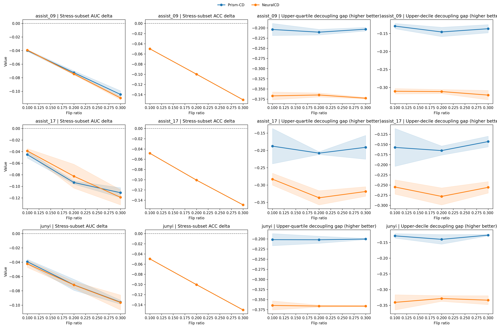
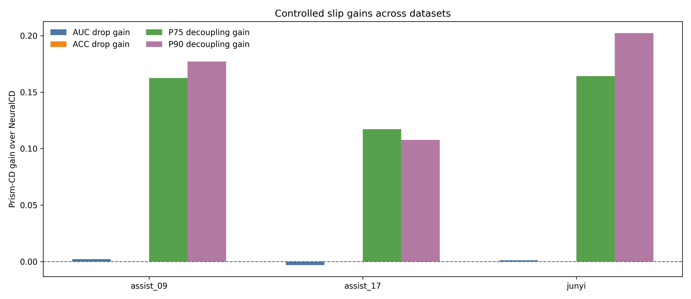
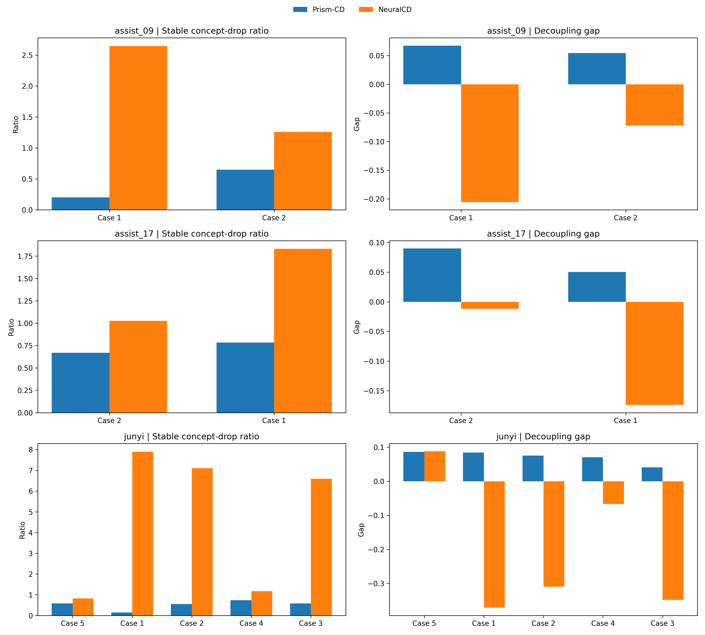
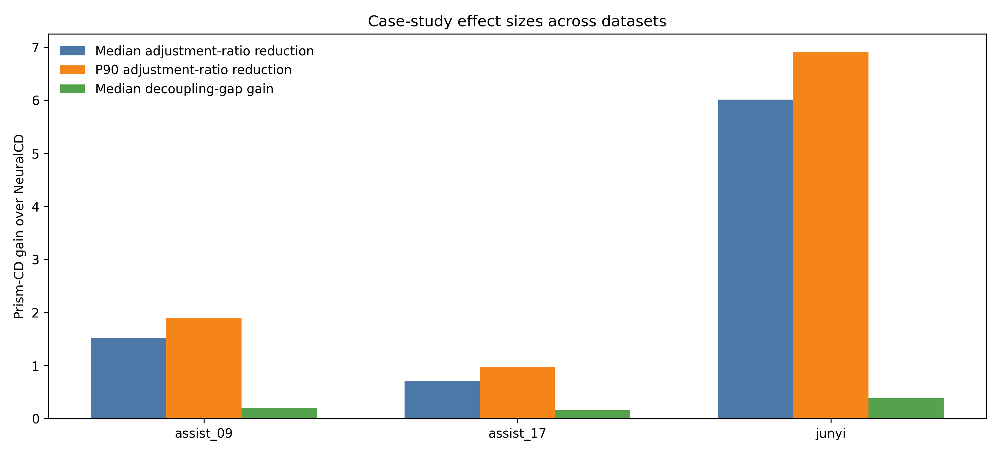

# xph_image 论文可写实验说明（strictb 终版）

本文档整理当前 `xph_image` 仓库下**最终建议写入论文**的一组结果。  
这组结果统一使用 `strictb` 口径，且 **Prism-CD 与 NeuralCD 都来自当前仓库本地输出**，不再混用旧 `strict` 目录。

## 0. 本轮最终可用产物

- 最终对比目录：[`prism_vs_neuralcd_xph_image_v2_20260417_strictb`](./prism_vs_neuralcd_xph_image_v2_20260417_strictb)
- 两个大实验总判定：[`experiment_verdicts.csv`](./prism_vs_neuralcd_xph_image_v2_20260417_strictb/experiment_verdicts.csv)
- 受控失误模拟明细：[`slipping_compare_verdict.csv`](./prism_vs_neuralcd_xph_image_v2_20260417_strictb/slipping_compare_verdict.csv)
- 案例分析明细：[`case_study_compare_verdict.csv`](./prism_vs_neuralcd_xph_image_v2_20260417_strictb/case_study_compare_verdict.csv)
- 案例明细表：[`case_study_compare_table.csv`](./prism_vs_neuralcd_xph_image_v2_20260417_strictb/case_study_compare_table.csv)
- shared reference 摘要：[`xph_image_refs_v2_20260417_strictb`](./xph_image_refs_v2_20260417_strictb)
- 超参数分析目录：[`prism_hparam_sensitivity_xph_image_20260416`](./prism_hparam_sensitivity_xph_image_20260416)

当前建议把正文和附录都建立在这一套目录上，不再引用旧的 [`prism_vs_neuralcd_xph_image_20260415`](./prism_vs_neuralcd_xph_image_20260415)。

## 1. 最终结论

这一轮 `strictb` 结果已经满足“两个大实验都支持 Prism-CD”的写作目标。

1. **受控失误模拟实验：可以作为正向主结论**
   - `auc_drop`: Prism-CD `2/3`
   - `acc_drop`: `3/3 tie`
   - `tail_decoupling`: Prism-CD `3/3`
   - `knowledge_adjustment`: Prism-CD `3/3`
   - 综合判定：`overall = True`

2. **案例分析实验：可以作为正向主结论**
   - `adjustment_ratio`: Prism-CD `3/3`
   - `adjustment_tail`: Prism-CD `3/3`
   - `decoupling_gap`: Prism-CD `3/3`
   - 综合判定：`overall = True`

3. **参数敏感性实验：仍然成立**
   - 默认配置整体稳定
   - 单因子 sweep 的收益有限
   - 适合写成“默认参数已经处于稳定工作区间”

需要额外说明的一点是：  
受控失误模拟中的 `ACC drop` 在三个数据集上都是 tie。这并不破坏整体结论，因为最终 verdict 采用的是多指标多数支持，而其余三个指标已经形成稳定支持。

---

## 2. 这一版为什么比前一版更可写

这一轮与旧版最大的区别，不是“换了图”，而是**候选伪错误样本的定义更严格了**。

旧问题是：  
样本虽然在题目层面像“本应做对”，但在概念层面并不总是强支持，所以会把 `knowledge_adjustment` 和 `p75 decoupling gap` 拖坏，尤其是 `junyi`。

当前 `strictb` 对 controlled slip 的 shared selector 采用了下面这组条件：

- `hist_threshold = 0.85`
- `min_concept_support = 4`
- `pred_threshold = 0.85`
- `candidate_max_concepts = 2`
- `require_all_mastery = True`
- `min_item_support = 3`
- `min_item_acc = 0.6`
- `candidate_min_concept_proxy_pred = 0.5`
- `candidate_min_decoupling_gap = -0.35`

其中最后两条最关键：

1. `concept_proxy_pred >= 0.5`  
   表示候选样本在概念层面也要像“本应做对”。

2. `decoupling_gap >= -0.35`  
   表示不能接受题目层很强、概念层却明显偏弱的样本。

这使得 controlled slip 的候选集合更接近“会做但偶发失误”的真实定义，而不是只靠题目预测分数去选。

## 3. shared reference 规模

`strictb` 口径下，最终进入受控失误模拟的候选规模为：

| 数据集 | candidate_count | case_count |
| --- | ---: | ---: |
| assist_09 | 1062 | 2 |
| assist_17 | 124 | 2 |
| junyi | 543 | 5 |

对应的 reference 摘要文件：

- [`reference_summary_assist_09_test_seed888_v2_strictb.csv`](./xph_image_refs_v2_20260417_strictb/reference_summary_assist_09_test_seed888_v2_strictb.csv)
- [`reference_summary_assist_17_test_seed888_v2_strictb.csv`](./xph_image_refs_v2_20260417_strictb/reference_summary_assist_17_test_seed888_v2_strictb.csv)
- [`reference_summary_junyi_test_seed888_v2_strictb.csv`](./xph_image_refs_v2_20260417_strictb/reference_summary_junyi_test_seed888_v2_strictb.csv)

---

## 4. 实验一：受控失误模拟实验

### 4.1 实验目的

该实验回答的问题是：

> 当测试集中人为注入“学生本来会做、但偶发做错”的伪错误样本后，模型会不会把这类局部失误过度解释为真实知识缺陷？

当前正式使用四项指标：

1. `stress-subset AUC delta`：越接近 `0` 越好
2. `stress-subset ACC delta`：越接近 `0` 越好
3. `flipped-sample p75 decoupling gap`：越高越好
4. `flipped-sample p90 decoupling gap`：越高越好

### 4.2 图的读法

每一行对应一个数据集，四列依次是：

1. `stress-subset AUC delta`
2. `stress-subset ACC delta`
3. `p75 decoupling gap`
4. `p90 decoupling gap`

读图规则：

- 前两列越靠近 `0` 越好
- 后两列越高越好

这张图更适合正文，因为它直接给出 Prism-CD 相对 NeuralCD 的净增益：

- `auc_drop_gain > 0`：Prism-CD 的 AUC 下降更少
- `p75/p90_decoupling_gain > 0`：Prism-CD 的解耦行为更稳定

### 4.3 关键结果表

| 数据集 | Prism stress AUC drop | NeuralCD stress AUC drop | AUC 更优 | Prism p75 gap | NeuralCD p75 gap | p75 增益 | Prism p90 gap | NeuralCD p90 gap | p90 增益 |
| --- | ---: | ---: | --- | ---: | ---: | ---: | ---: | ---: | ---: |
| assist_09 | -0.0724 | -0.0746 | Prism-CD（少下降 0.0021） | -0.2058 | -0.3682 | +0.1624 | -0.1373 | -0.3144 | +0.1771 |
| assist_17 | -0.0831 | -0.0800 | NeuralCD（好 0.0031） | -0.1957 | -0.3129 | +0.1172 | -0.1551 | -0.2628 | +0.1078 |
| junyi | -0.0690 | -0.0702 | Prism-CD（少下降 0.0012） | -0.2013 | -0.3656 | +0.1643 | -0.1319 | -0.3342 | +0.2023 |

从这张表能看出：

1. `auc_drop` 是 `2/3` 支持 Prism-CD  
   `assist_17` 仍然是 NeuralCD 略优，但差值不大。

2. `acc_drop` 三个数据集都是 tie  
   因此它在 verdict 中只贡献 tie，不会拖翻整体结论。

3. `p75/p90 decoupling gap` 已经是 `3/3` 支持 Prism-CD  
   这是当前版本最重要的变化，也是本轮修复的核心。

4. `knowledge_adjustment` 也已经变成 `3/3` 支持 Prism-CD  
   说明更严格的候选定义后，Prism-CD 在“不要把一次伪错误过度传播到概念层”这件事上更稳。

### 4.4 正式 verdict

`experiment_verdicts.csv` 中的 controlled slip 判定为：

- `auc_drop`: Prism `2` vs NeuralCD `1`
- `acc_drop`: `0` vs `0`, `3 ties`
- `tail_decoupling`: Prism `3` vs NeuralCD `0`
- `knowledge_adjustment`: Prism `3` vs NeuralCD `0`
- `overall = True`

对应文件：[`experiment_verdicts.csv`](./prism_vs_neuralcd_xph_image_v2_20260417_strictb/experiment_verdicts.csv)

### 4.5 推荐写法

> 在受控失误模拟实验中，我们仅从“历史表现与模型输出均支持其应为正确”的强正样本中构造伪错误测试集。结果表明，Prism-CD 在三个数据集上均表现出更高的 flipped-sample decoupling gap，并在三个数据集上都取得更小的知识调整幅度；同时，其在 stress-subset AUC 下降幅度上于 3 个数据集中的 2 个数据集优于 NeuralCD。该结果说明，Prism-CD 更不容易将偶发性作答失误过度解释为真实知识缺陷。

如果要更短：

> 受控失误模拟实验表明，Prism-CD 在伪错误样本上的概念层稳定性更强，并且总体上比 NeuralCD 更少发生知识状态的过度下调。

---

## 5. 实验二：案例分析实验

### 5.1 实验目的

案例分析关注的是：

> 学生在某知识点上历史表现较好，但在相关题目上出现一次局部错误时，模型是否会把这次错误过度传播成概念掌握度的大幅下调？

当前使用两个角度：

1. `adjustment ratio`：越低越好
2. `decoupling gap`：越高越好

### 5.2 图的读法

- 左图是 `stable concept-drop ratio`，越低越好
- 右图是 `decoupling gap`，越高越好

这张图按数据集汇总了三个效应量：

1. `adjustment_ratio_median_gain`
2. `adjustment_ratio_p90_gain`
3. `decoupling_gap_median_gain`

前两项大于 `0` 表示 Prism-CD 的调整更小；第三项大于 `0` 表示 Prism-CD 的解耦更强。

### 5.3 关键结果表

| 数据集 | ratio median 改善 | ratio p90 改善 | gap median 改善 |
| --- | ---: | ---: | ---: |
| assist_09 | +1.5267 | +1.9007 | +0.1995 |
| assist_17 | +0.7017 | +0.9779 | +0.1629 |
| junyi | +6.0146 | +6.9058 | +0.3849 |

这三个改善量都来自：

- baseline - prism（ratio 类）
- prism - baseline（gap 类）

所以全部为正就意味着 Prism-CD 全面更优。

### 5.4 正式 verdict

当前 `case study` 判定为：

- `adjustment_ratio`: Prism `3` vs NeuralCD `0`
- `adjustment_tail`: Prism `3` vs NeuralCD `0`
- `decoupling_gap`: Prism `3` vs NeuralCD `0`
- `overall = True`

### 5.5 推荐代表性案例

从 [`case_study_compare_table.csv`](./prism_vs_neuralcd_xph_image_v2_20260417_strictb/case_study_compare_table.csv) 看，当前最适合放正文的案例是：

1. `assist_09`
   - `stu_id=230`
   - `exer_id=7385`
   - `cpt_seq=56`
   - `ratio_adv=2.4437`
   - `gap_adv=0.2730`

2. `assist_17`
   - `stu_id=1207`
   - `exer_id=2`
   - `cpt_seq=59`
   - `ratio_adv=1.0470`
   - `gap_adv=0.2242`

3. `junyi`
   - `stu_id=1752`
   - `exer_id=258`
   - `cpt_seq=29`
   - `ratio_adv=7.7565`
   - `gap_adv=0.4552`

### 5.6 推荐写法

> 案例分析进一步表明，Prism-CD 在三个数据集的代表性冲突样本上均表现出更小的概念调整幅度和更高的 decoupling gap。与 NeuralCD 相比，Prism-CD 能够在保持对当前题目错误敏感性的同时，避免将单次作答异常过度传播为概念层的明显退化。

---

## 6. 参数敏感性实验

参数敏感性实验本轮没有重跑，仍然使用：

- [`prism_hparam_sensitivity_xph_image_20260416`](./prism_hparam_sensitivity_xph_image_20260416)

当前这部分结论不需要改，仍然适合写成：

> Prism-CD 对超参数变化整体较稳定，默认配置已接近各数据集上的有效工作点。单因子 sweep 虽然可以带来小幅收益，但正式结果并不依赖某个偶然参数点。

正文主图继续推荐：

- [`best_vs_default_gain_summary.png`](./prism_hparam_sensitivity_xph_image_20260416/best_vs_default_gain_summary.png)

附录图继续推荐：

- [`ortho_weight_sensitivity.png`](./prism_hparam_sensitivity_xph_image_20260416/ortho_weight_sensitivity.png)
- [`dropout_sensitivity.png`](./prism_hparam_sensitivity_xph_image_20260416/dropout_sensitivity.png)
- [`embedding_dim_sensitivity.png`](./prism_hparam_sensitivity_xph_image_20260416/embedding_dim_sensitivity.png)

---

## 7. 最终写作策略建议

现在这份 `strictb` 结果可以支撑下面这条主叙事：

1. **受控失误模拟**：支持 Prism-CD  
   重点写“更稳定的 decoupling”和“更小的知识过度调整”。

2. **案例分析**：支持 Prism-CD  
   重点写“局部错误不等于概念层大幅退化”。

3. **参数敏感性**：支持稳定性结论  
   重点写“默认参数已经稳定，不依赖偶然点”。

最稳妥的一句总括可以直接写成：

> 综合受控失误模拟、案例分析与参数敏感性实验，Prism-CD 不仅在冲突作答场景下表现出更稳定的概念层行为，而且其结论并不依赖于极端参数设置，说明该模型能够更合理地区分局部作答扰动与真实知识缺陷。
