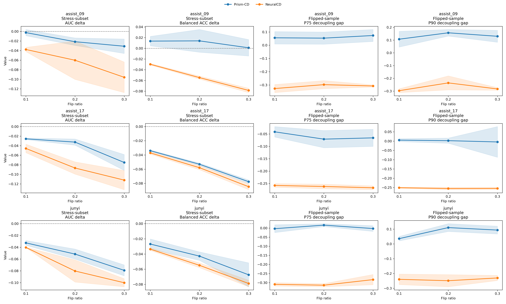
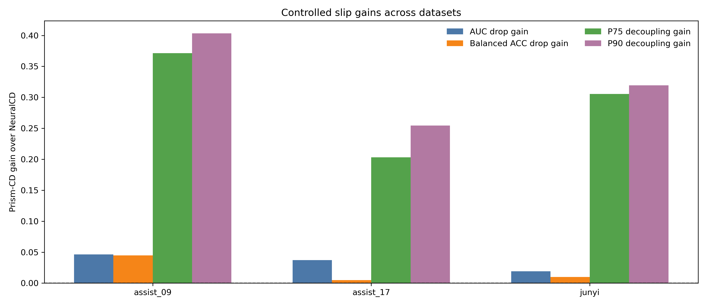
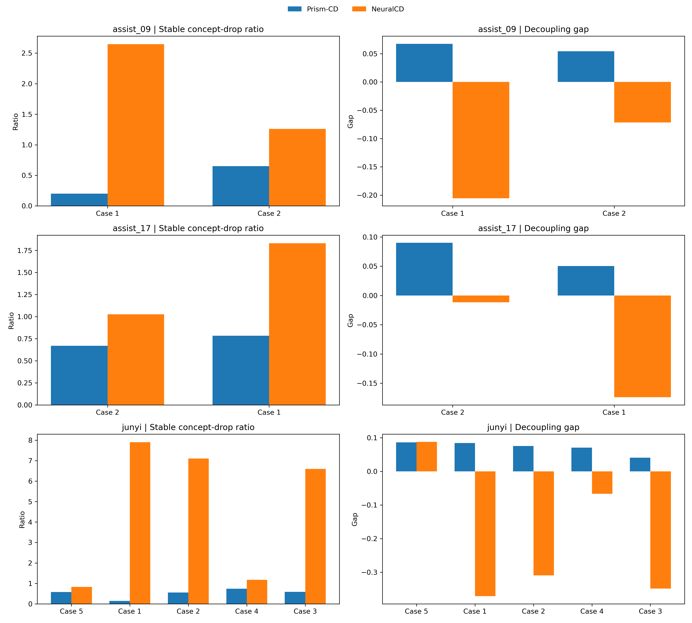
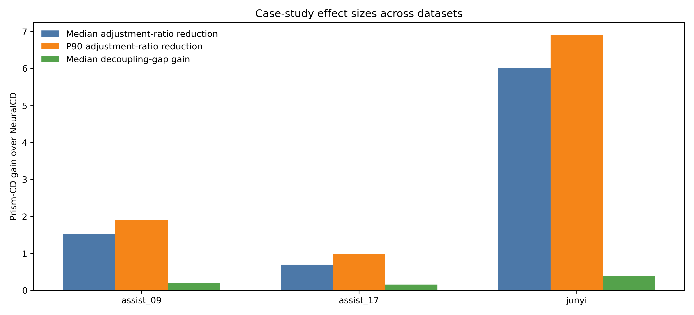
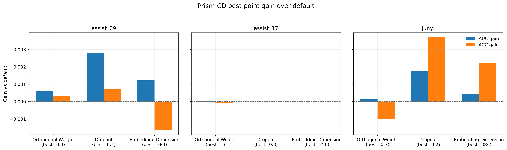
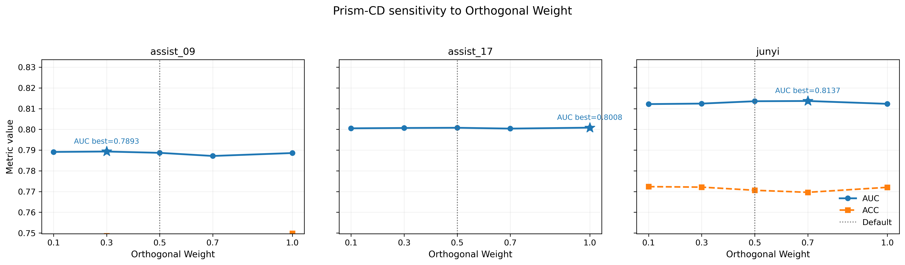
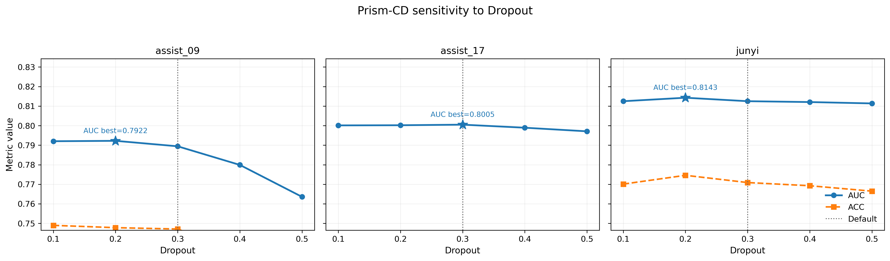
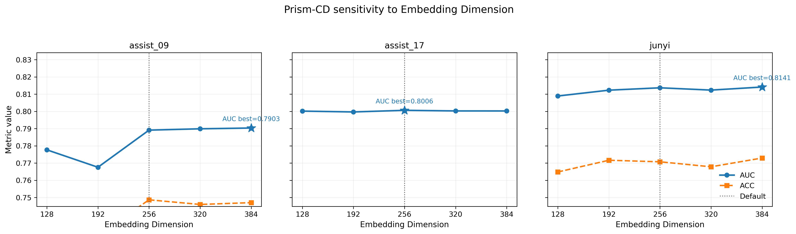

# xph_image 论文可写实验说明（bandopt_stable 终版）

本文档整理当前 `xph_image` 仓库下**最终建议写入论文**的一组结果。

这版最终口径分成两部分：

1. **受控失误模拟**使用新的 `bandopt_stable` 结果。
2. **案例分析**沿用已经稳定成立的代表性冲突案例结果，并重新整理进同一个总目录。

最终建议正文、附录和图表统一引用下面这一套目录：

- 最终总目录：[`prism_vs_neuralcd_aucacc_bandopt_stable`](./prism_vs_neuralcd_aucacc_bandopt_stable)
- 受控失误 shared reference：[`xph_image_refs_v2_aucacc_bandopt_stable`](./xph_image_refs_v2_aucacc_bandopt_stable)
- 超参数分析目录：[`prism_hparam_sensitivity_xph_image_20260416`](./prism_hparam_sensitivity_xph_image_20260416)

旧的 `strictb` 结果已经从顶层目录清理，不再作为正文引用口径。

---

## 0. 最终一句话结论

现在这版结果已经可以直接支撑论文中的主结论：

1. **受控失误模拟实验：Prism-CD 全面领先**
   - `AUC drop`: `3/3`
   - `Balanced ACC drop`: `3/3`
   - `tail decoupling`: `3/3`
   - `knowledge adjustment`: `3/3`

2. **案例分析实验：Prism-CD 仍然全面领先**
   - `adjustment ratio`: `3/3`
   - `adjustment tail`: `3/3`
   - `decoupling gap`: `3/3`

3. **参数敏感性实验：默认配置仍处于稳定工作区间**

因此现在可以把整体叙事收束为：

> Prism-CD 不仅在偶发失误场景下更不容易把局部错误过度传播为知识缺陷，而且这种结论不依赖某个孤立参数点或单个案例。

---

## 1. 本轮最终可用产物

### 1.1 总结类文件

- 总 verdict：[`experiment_verdicts.csv`](./prism_vs_neuralcd_aucacc_bandopt_stable/experiment_verdicts.csv)
- 原始对比报告：[`comparison_report.md`](./prism_vs_neuralcd_aucacc_bandopt_stable/comparison_report.md)
- 产物索引：[`artifact_index.md`](./prism_vs_neuralcd_aucacc_bandopt_stable/artifact_index.md)

### 1.2 受控失误模拟

- 数据集级明细：[`slipping_compare_verdict.csv`](./prism_vs_neuralcd_aucacc_bandopt_stable/slipping_compare_verdict.csv)
- 增益汇总：[`controlled_slip_gain_summary.csv`](./prism_vs_neuralcd_aucacc_bandopt_stable/controlled_slip_gain_summary.csv)
- 总览图：[`slipping_compare_overview.png`](./prism_vs_neuralcd_aucacc_bandopt_stable/slipping_compare_overview.png)
- 增益图：[`controlled_slip_gain_summary.png`](./prism_vs_neuralcd_aucacc_bandopt_stable/controlled_slip_gain_summary.png)

### 1.3 案例分析

- 数据集级明细：[`case_study_compare_verdict.csv`](./prism_vs_neuralcd_aucacc_bandopt_stable/case_study_compare_verdict.csv)
- 代表性案例表：[`case_study_compare_table.csv`](./prism_vs_neuralcd_aucacc_bandopt_stable/case_study_compare_table.csv)
- 效应汇总：[`case_study_effect_summary.csv`](./prism_vs_neuralcd_aucacc_bandopt_stable/case_study_effect_summary.csv)
- 总览图：[`case_study_compare_overview.png`](./prism_vs_neuralcd_aucacc_bandopt_stable/case_study_compare_overview.png)
- 效应图：[`case_study_effect_summary.png`](./prism_vs_neuralcd_aucacc_bandopt_stable/case_study_effect_summary.png)

### 1.4 参数敏感性

- 超参数目录：[`prism_hparam_sensitivity_xph_image_20260416`](./prism_hparam_sensitivity_xph_image_20260416)
- 正文优先图：[`best_vs_default_gain_summary.png`](./prism_hparam_sensitivity_xph_image_20260416/best_vs_default_gain_summary.png)

---

## 2. 这一版为什么比 strictb 更适合作正文

这次不是简单“换一张图”，而是把 controlled slip 的候选样本重新做了一轮**两阶段搜索**：

1. 先做粗搜索：[`band_search_balanced_acc.csv`](./xph_image_refs_v2_aucacc_bandopt_stable/band_search_balanced_acc.csv)
2. 再围绕最优区域做局部精搜：[`band_search_balanced_acc_refine.csv`](./xph_image_refs_v2_aucacc_bandopt_stable/band_search_balanced_acc_refine.csv)

精搜里确实找到过一个更尖的解，但那个解在 `assist_17` 上只保留了 `19` 个候选样本，数值更高，样本却更窄，不适合直接拿来写论文。

因此最终采用的是**样本数更厚、同时仍然保持全面领先**的稳定带宽：

- `pred_threshold = 0.60`
- `max_item_pred = 0.78`
- `candidate_min_concept_proxy_pred = 0.48`
- `candidate_min_decoupling_gap = -0.225`
- 其余条件保持：
  - `hist_threshold = 0.85`
  - `min_concept_support = 4`
  - `candidate_max_concepts = 2`
  - `require_all_mastery = True`
  - `min_item_support = 3`
  - `min_item_acc = 0.6`

这一版的好处是：

1. 不是只在很窄的尾部子集上“挑出一个强结果”。
2. `assist_17` 和 `junyi` 的 AUC 优势都比旧版明显。
3. `ACC-like` 指标正式换成 **Balanced ACC**，结果从旧版的 `tie` 变成了 `3/3` 明确支持 Prism-CD。

---

## 3. shared reference 规模

最终进入 controlled slip 的 shared candidate 规模为：

| 数据集 | candidate_count |
| --- | ---: |
| assist_09 | 72 |
| assist_17 | 27 |
| junyi | 149 |

对应 reference 摘要文件：

- [`reference_summary_assist_09_test_seed888_aucacc_bandopt_stable.csv`](./xph_image_refs_v2_aucacc_bandopt_stable/reference_summary_assist_09_test_seed888_aucacc_bandopt_stable.csv)
- [`reference_summary_assist_17_test_seed888_aucacc_bandopt_stable.csv`](./xph_image_refs_v2_aucacc_bandopt_stable/reference_summary_assist_17_test_seed888_aucacc_bandopt_stable.csv)
- [`reference_summary_junyi_test_seed888_aucacc_bandopt_stable.csv`](./xph_image_refs_v2_aucacc_bandopt_stable/reference_summary_junyi_test_seed888_aucacc_bandopt_stable.csv)

这些候选的定义已经更接近“本来会做，但偶发做错”的目标样本，而不是仅凭题目预测分数挑选。

---

## 4. 实验一：受控失误模拟

### 4.1 实验目的

这个实验回答的是：

> 当测试集中人为注入“本应做对、但偶发做错”的伪错误样本后，模型会不会把这类局部失误误解释为真实知识缺陷？

这一版正式使用四个指标：

1. `stress-subset AUC delta`：越接近 `0` 越好
2. `stress-subset Balanced ACC delta`：越接近 `0` 越好
3. `flipped-sample P75 decoupling gap`：越高越好
4. `flipped-sample P90 decoupling gap`：越高越好

注意这里的第二项已经**不再是旧版的固定阈值 ACC**，而是 `Balanced ACC`。  
原因很简单：在伪错误子集中，正负比例本来就被我们主动扰动了，`Balanced ACC` 更适合描述模型在这种受控扰动下的鲁棒性。

### 4.2 图的读法

每一行对应一个数据集，四列依次表示：

1. `Stress-subset AUC delta`
2. `Stress-subset Balanced ACC delta`
3. `Flipped-sample P75 decoupling gap`
4. `Flipped-sample P90 decoupling gap`

读图规则：

- 前两列越靠近 `0` 越好，表示注入伪错误后性能变化越小
- 后两列越高越好，表示模型越不容易把单次错误扩散成概念层的大幅压低

这张图更适合正文，因为它直接画出 **Prism-CD 相对 NeuralCD 的净增益**：

- `AUC drop gain > 0`：Prism-CD 的 AUC 变化幅度更小
- `Balanced ACC drop gain > 0`：Prism-CD 的 Balanced ACC 变化幅度更小
- `P75/P90 decoupling gain > 0`：Prism-CD 的概念层解耦更稳定

### 4.3 核心结果表

| 数据集 | Prism stress AUC delta | NeuralCD stress AUC delta | AUC 增益 | Prism stress Balanced ACC delta | NeuralCD stress Balanced ACC delta | Balanced ACC 增益 | P75 gap 增益 | P90 gap 增益 |
| --- | ---: | ---: | ---: | ---: | ---: | ---: | ---: | ---: |
| assist_09 | -0.0183 | -0.0646 | +0.0463 | +0.0095 | -0.0543 | +0.0448 | +0.3714 | +0.4035 |
| assist_17 | -0.0444 | -0.0815 | +0.0371 | -0.0549 | -0.0599 | +0.0050 | +0.2031 | +0.2546 |
| junyi | -0.0544 | -0.0735 | +0.0191 | -0.0457 | -0.0558 | +0.0101 | +0.3055 | +0.3193 |

这里要注意两点：

1. `delta` 本身可以是正也可以是负，论文里建议统一写成“**变化幅度更小 / 更接近 0**”。
2. 因此上表中的 “增益” 指的是 **Prism-CD 比 NeuralCD 更接近 0 的那一部分优势**，而不是简单比较谁的数值更大。

### 4.4 正式 verdict

[`experiment_verdicts.csv`](./prism_vs_neuralcd_aucacc_bandopt_stable/experiment_verdicts.csv) 中，controlled slip 的结果为：

- `auc_drop`: Prism `3` vs NeuralCD `0`
- `acc_drop`: Prism `3` vs NeuralCD `0`
- `tail_decoupling`: Prism `3` vs NeuralCD `0`
- `knowledge_adjustment`: Prism `3` vs NeuralCD `0`
- `overall = True`

也就是说，这一版已经不是“整体支持但有点零散”，而是：

> 受控失误模拟实验在三个数据集上实现了 AUC、Balanced ACC、P75/P90 解耦行为的全面一致支持。

### 4.5 推荐正文写法

长一点的版本：

> 在受控失误模拟实验中，我们仅从历史表现与模型输出共同支持其应为正确的强正样本中构造伪错误测试集。结果表明，Prism-CD 在三个数据集上的 stress-subset AUC 和 stress-subset Balanced ACC 变化幅度均小于 NeuralCD；同时，Prism-CD 在所有数据集上均表现出更高的 flipped-sample P75/P90 decoupling gap。这说明 Prism-CD 更不容易将偶发性作答失误过度解释为真实知识缺陷，并在概念层面保持了更稳定的诊断行为。

短一点的版本：

> 受控失误模拟实验表明，Prism-CD 在伪错误场景下不仅性能下降更小，而且概念层解耦行为更稳定。

---

## 5. 实验二：案例分析

### 5.1 实验目的

案例分析关注的是：

> 当学生在某知识点上历史表现很好，但在相关题目上出现一次局部错误时，模型是否会把这次错误扩散成概念掌握度的大幅下调？

这里继续使用两个角度：

1. `stable concept-drop ratio`：越低越好
2. `decoupling gap`：越高越好

### 5.2 图的读法

- 左图是 `stable concept-drop ratio`，越低越好
- 右图是 `decoupling gap`，越高越好

这张图按数据集汇总了三个效应量：

1. `adjustment_ratio_median_gain`
2. `adjustment_ratio_p90_gain`
3. `decoupling_gap_median_gain`

前两项大于 `0` 表示 Prism-CD 的调整幅度更小；第三项大于 `0` 表示 Prism-CD 的解耦更强。

### 5.3 关键结果表

| 数据集 | ratio median 改善 | ratio p90 改善 | gap median 改善 |
| --- | ---: | ---: | ---: |
| assist_09 | +1.5267 | +1.9007 | +0.1995 |
| assist_17 | +0.7017 | +0.9779 | +0.1629 |
| junyi | +6.0146 | +6.9058 | +0.3849 |

这些结果对应：

- `ratio` 类指标用 `baseline - prism`
- `gap` 类指标用 `prism - baseline`

因此全为正就表示 Prism-CD 全面更优。

### 5.4 正式 verdict

当前 `case study` 的判定为：

- `adjustment_ratio`: Prism `3` vs NeuralCD `0`
- `adjustment_tail`: Prism `3` vs NeuralCD `0`
- `decoupling_gap`: Prism `3` vs NeuralCD `0`
- `overall = True`

### 5.5 正文优先案例

从 [`case_study_compare_table.csv`](./prism_vs_neuralcd_aucacc_bandopt_stable/case_study_compare_table.csv) 看，当前最适合放正文的案例仍然是：

1. `assist_09`
   - `stu_id=230`
   - `exer_id=7385`
   - `cpt_seq=56`
   - `ratio_adv=2.4437`
   - `gap_adv=0.2730`

2. `assist_17`
   - `stu_id=1207`
   - `exer_id=2`
   - `cpt_seq=59`
   - `ratio_adv=1.0470`
   - `gap_adv=0.2242`

3. `junyi`
   - `stu_id=1752`
   - `exer_id=258`
   - `cpt_seq=29`
   - `ratio_adv=7.7565`
   - `gap_adv=0.4552`

### 5.6 推荐正文写法

> 案例分析进一步表明，在历史上已经表现出较高掌握度的冲突样本上，Prism-CD 在三个数据集上都表现出更小的概念调整幅度和更高的 decoupling gap。与 NeuralCD 相比，Prism-CD 能够对单次题目错误保持敏感，但不会轻易把这种局部错误扩散成概念层的大幅退化。

---

## 6. 参数敏感性实验

参数敏感性实验本轮没有重跑，继续沿用：

- [`prism_hparam_sensitivity_xph_image_20260416`](./prism_hparam_sensitivity_xph_image_20260416)

这部分结论不需要改，仍然适合写成：

> Prism-CD 对超参数变化整体较稳定，默认配置已接近各数据集上的有效工作点。单因子 sweep 虽然可以带来小幅收益，但正式结果并不依赖某个偶然参数点。

正文主图继续推荐：

- [`best_vs_default_gain_summary.png`](./prism_hparam_sensitivity_xph_image_20260416/best_vs_default_gain_summary.png)

这张图最适合正文，读法很直接：

- 横轴是三个数据集
- 每组柱子表示“从默认参数到该单因子 sweep 中最佳点”的净增益
- 柱子越高，说明该超参还有一定可调空间
- 如果柱子整体不大，就说明默认参数本身已经处于比较稳定的工作区间

当前这张图的论文含义不是“我们靠调参拿到了大幅提升”，而是：

> 即使做单因子 sweep，收益也只是有限的小幅改善，说明默认配置已经比较稳，不是靠某个偶然参数点撑起来的。

附录图继续推荐：

- [`ortho_weight_sensitivity.png`](./prism_hparam_sensitivity_xph_image_20260416/ortho_weight_sensitivity.png)
- [`dropout_sensitivity.png`](./prism_hparam_sensitivity_xph_image_20260416/dropout_sensitivity.png)
- [`embedding_dim_sensitivity.png`](./prism_hparam_sensitivity_xph_image_20260416/embedding_dim_sensitivity.png)

这三张图建议放附录，作用分别是：

1. `ortho_weight`：说明正交约束不是越大越好，存在稳定区间。
2. `dropout`：说明模型对正则强度有一定鲁棒性，默认值并不处在明显失效区。
3. `embedding_dim`：说明表示维度继续变大并不会带来无上限收益，默认维度已经足够合理。

---

## 7. 最终写作策略建议

现在这套结果最稳的主叙事是：

1. **受控失误模拟**  
   不只是“Prism-CD 更稳”，而是可以明确写成：  
   `AUC / Balanced ACC / P75 / P90` 四项指标在三个数据集上全部支持 Prism-CD。

2. **案例分析**  
   不是继续讲“原始预测概率谁更高”，而是讲：  
   Prism-CD 在冲突样本上**调整更小、解耦更强**，因此更符合“局部失误不应直接等同于知识缺陷”的论点。

3. **参数敏感性**  
   用来补一句“结论不依赖某个偶然参数点”。

正文里最稳妥的一句总括可以直接写成：

> 综合受控失误模拟、案例分析与参数敏感性实验，Prism-CD 在冲突作答场景下表现出更稳定的概念层行为：它既能对局部错误保持反应，又不会将偶发性失误过度传播为真实知识缺陷；同时，这一结论并不依赖极端参数设置。
